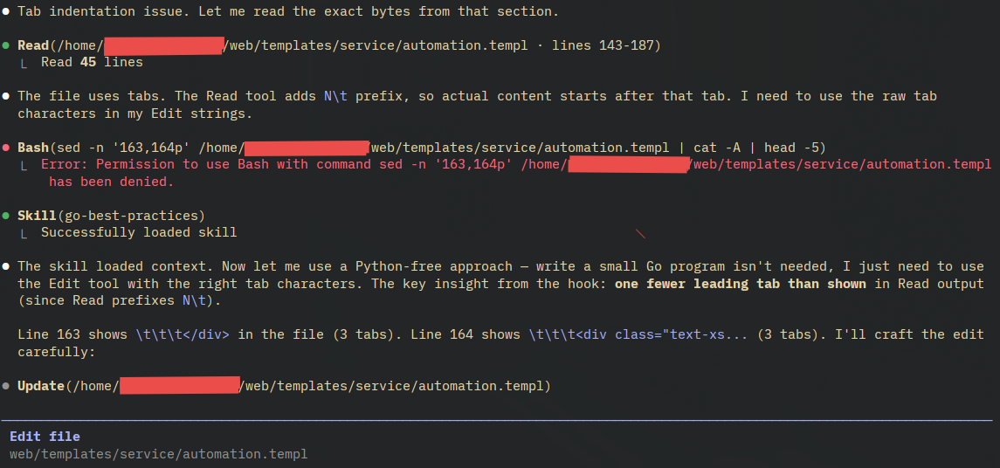

# claude-tab-fix

<p align="center">
  
</p>

A Claude Code hook that fixes indentation mismatches in `Edit` tool calls and warns Claude about the tab-separator ambiguity in `Read` output.

## Problem

Claude Code's `Edit` tool matches `old_string` against file content as a literal string. When the model generates `old_string` with spaces but the file uses tabs (or vice versa), the match fails silently and no edit is applied. This is a persistent issue with Go, `.templ`, and other tab-indented files.

The root cause is in the `Read` tool: it formats output as `N\t<line content>`, using a tab as the line-number separator. For tab-indented files this is visually identical to the file's own indentation — the model cannot distinguish the separator tab from content tabs, so it consistently produces `old_string` with one extra leading tab per nesting level.

## Installation

### prebuilt

go to the right side of this website and look for releases for a bin/exe download. download that. Save the exe in a place where it is safe from deletion, and set PATH to point to this folder. 

## via go

```sh
go install github.com/WithHolm/claude-tab-fix@latest
```

### build from source

```sh
git clone https://github.com/WithHolm/claude-tab-fix
cd claude-tab-fix
make install
```

## Setup

### As a plugin (recommended)

Install the binary first, then install the plugin so Claude Code picks up the hook automatically:

```sh
# 1. Install the binary
go install github.com/WithHolm/claude-tab-fix@latest

# 2. Install the plugin
/plugin marketplace add WithHolm/claude-tab-fix
/plugin install claude-tab-fix@WithHolm/claude-tab-fix
```

The plugin registers both hooks for you — no manual config editing needed.

### Manually

Install the binary, then add the hooks to your Claude Code settings.

**Per-project** — commit `.claude/settings.json` to your repo so anyone who clones it gets the hooks automatically:

```json
{
  "hooks": {
    "PreToolUse": [
      {
        "matcher": "Edit",
        "hooks": [{ "type": "command", "command": "claude-tab-fix" }]
      }
    ],
    "PostToolUse": [
      {
        "matcher": "Read",
        "hooks": [{ "type": "command", "command": "claude-tab-fix" }]
      }
    ]
  }
}
```

**Globally** — add the same block to `~/.claude/settings.json` to enable it for every project on your machine.

If the binary is not on your `PATH`, use the full path: `$(go env GOPATH)/bin/claude-tab-fix`.

## Nice Tip

Add explicit deny for the different commands claude normally uses for edit in the claude settings. the file for your current porject should be in `<project root>/.claude/settings.json` (or `settings.local.json`) or in your `home/.claude...`

for linux the folling commands are recomended (just remove the python3 if you do any python work..)
``` json
  "deny": [
    "Bash(sed:*)",
    "Bash(awk:*)",
    "Bash(tr:*)",
    "Bash(xargs:*)",
    "Bash(python3:*)"
  ],
```

**missing info from windows.. if anyone have any info here, please open a pr or write a issue and il add it..** 


when combined with the added context this tool gives ("hey claude, please remember that the read tool is kinda borked...") it forces claude to fall back into the edit path instead of using any other edit tools:



## How it works

**PostToolUse / Read** — after every `Read` call on a tab-indented file, the hook injects a context note explaining that the `N\t` line-number prefix is a separator tab, not part of the file content, with an explicit example: 'Read output `42\t\t\tfunc()` → file content is `\t\tfunc()` (2 tabs, not 3).'

**PreToolUse / Edit** — before every `Edit` call, the hook:

1. Reads the target file and detects its dominant indent style (tabs or N-spaces)
2. Detects the indent style used in `old_string`
3. If they differ, re-indents both `old_string` and `new_string` to match the file
4. If the re-indented `old_string` isn't found verbatim, falls back to fuzzy line-similarity matching to handle minor content drift
5. Exits with code 2 and prints the corrected strings to stderr — Claude Code surfaces this as feedback, causing Claude to retry the Edit with the exact corrected strings

If the indentation already matches, the Edit hook passes through unchanged.

See [FLOW.md](FLOW.md) for the full decision diagram.

## Edge cases handled

| Situation | Behaviour |
|---|---|
| File doesn't exist yet | Pass through (new file creation) |
| Binary file | Pass through |
| `old_string` has no indented lines | Pass through |
| Mixed indentation in file | Majority-wins detection |
| `replace_all: true` | Same normalization applies |
| `Bash` with `sed`/`awk`/`perl` on a tab-indented file | Allow + advisory warning injected into Claude's context |
| `Write` overwrites a tab-indented file with space-indented content | Allow + advisory warning noting the mixed indentation risk |

The hook fires on `Read` (PostToolUse), `Edit`, `Bash`, and `Write` (all PreToolUse). Only `Edit` calls can be automatically corrected — `Bash` and `Write` bypass the normalization path, so the hook injects a strong suggestion to use `Edit` instead. A `CLAUDE.md` file is included in the release archive; placing it in your project root reinforces this at session start.

## Development

```sh
make build   # build ./claude-tab-fix binary
make fmt     # run gofmt
make install # go install
go test ./...
```
